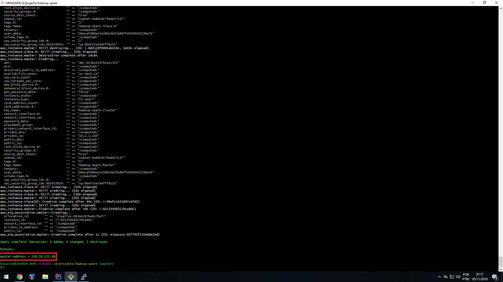
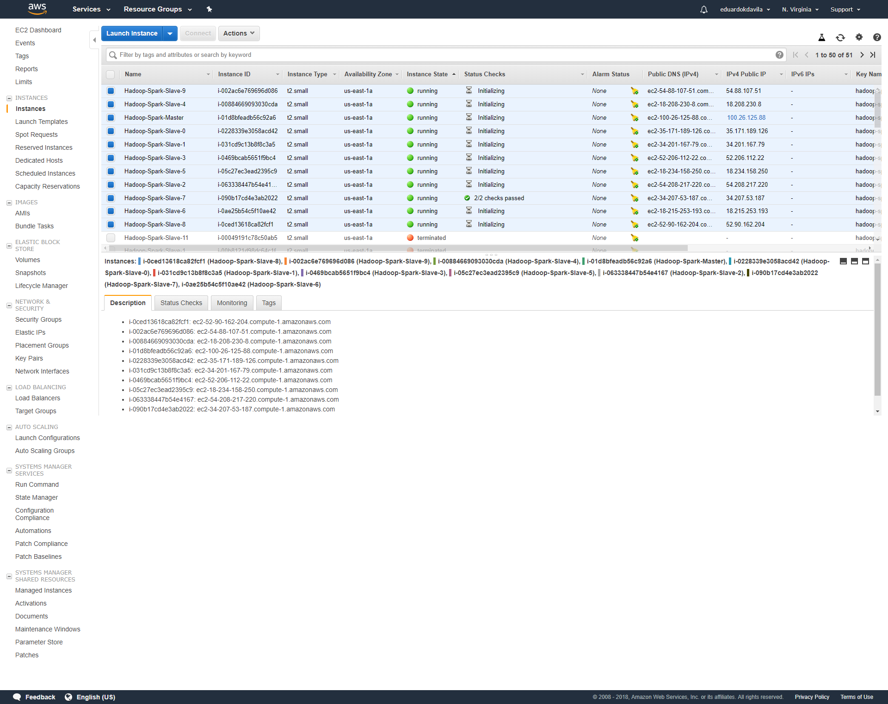
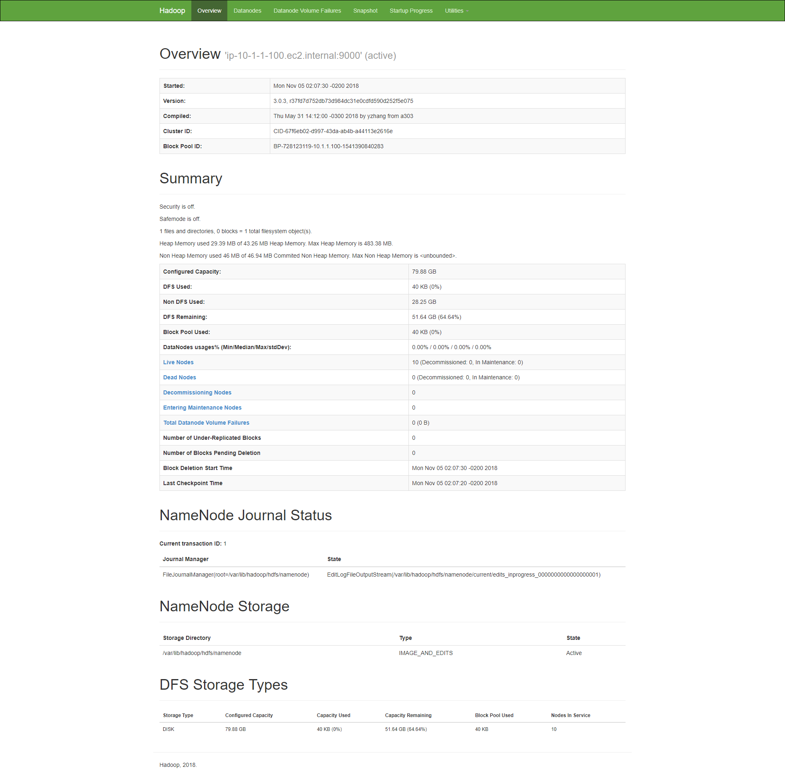
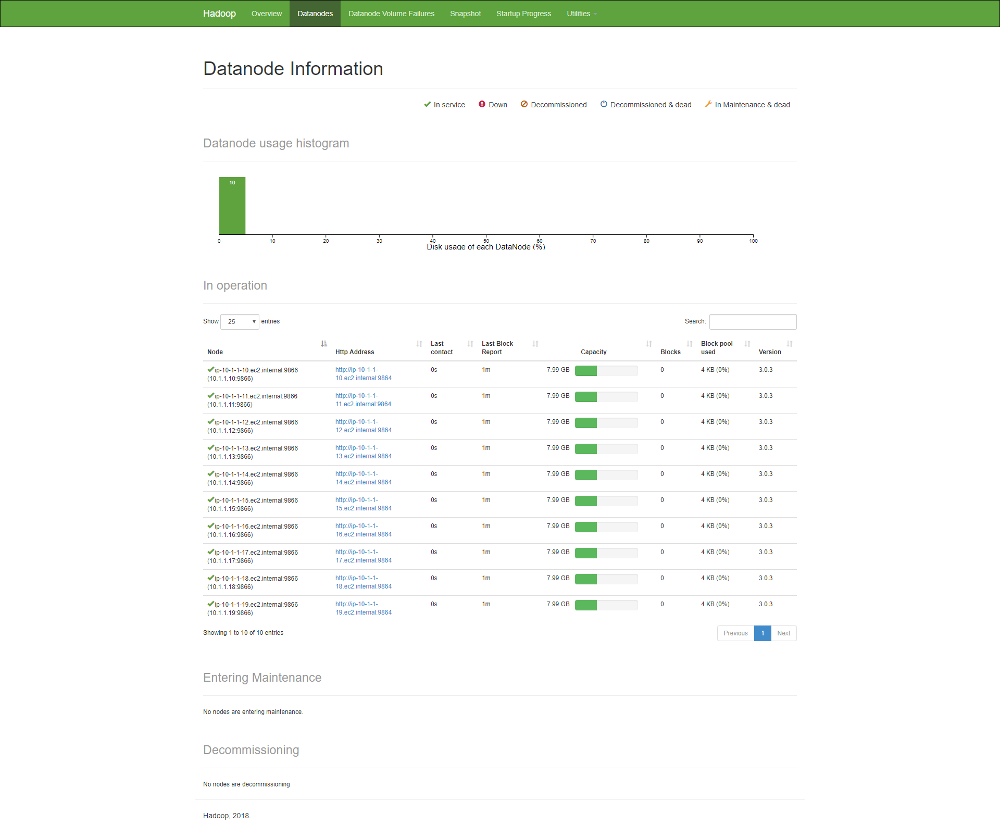
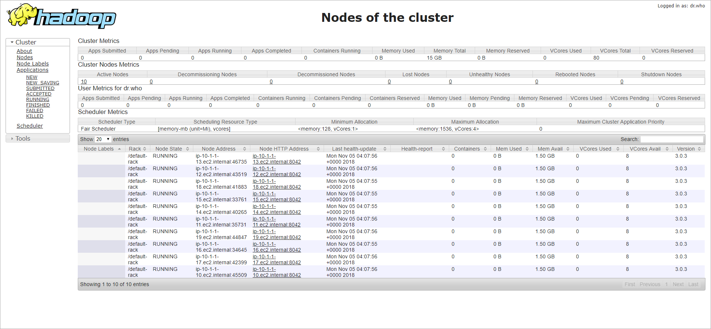
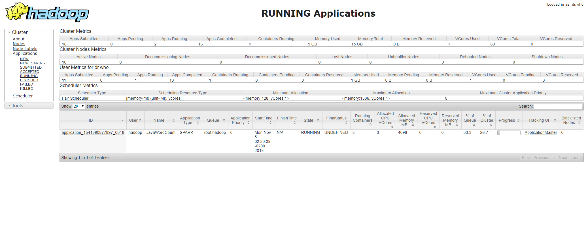
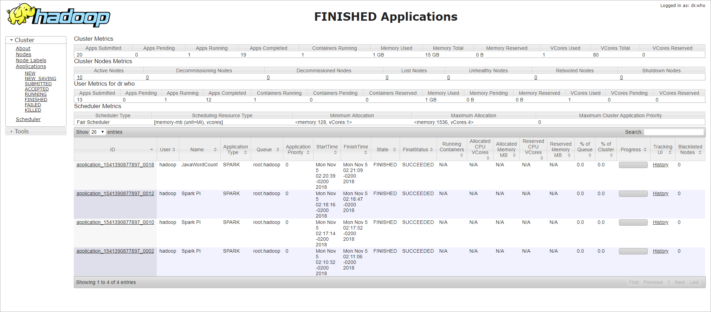
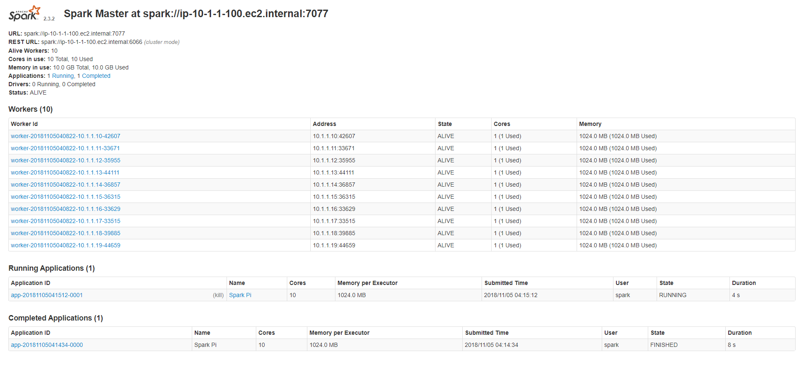
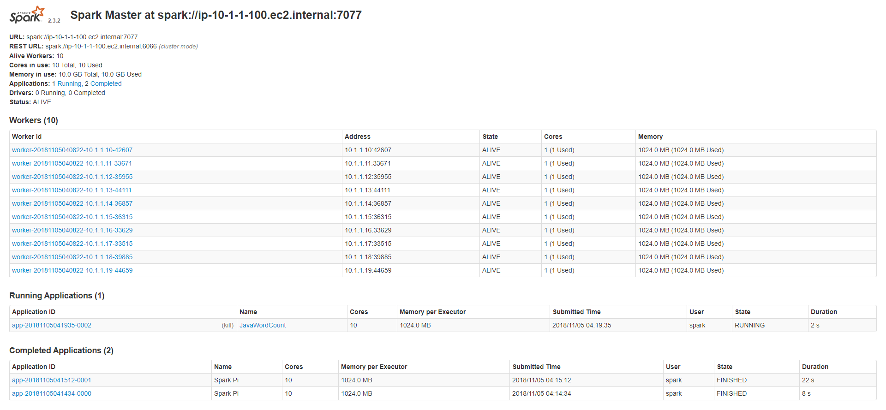

# Configuração de um cluster Hadoop e Spark na AWS

## Introdução

Para este exercício, não vamos nos preocupar com a segurança do cluster. Nosso foco é rodar aplicações Hadoop
e Spark em um cluster de dez servidores slaves e um servidor master.

Para criar toda esta estrutura dentro da AWS, utilizaremos a ferramenta de automação Terraform. A ferramenta
se encarregará de criar a estrutura de rede e iniciar as instâncias, que subirão com um script automatizado
que efetuará o download e instalação do Hadoop e Spark nas instâncias.

Por fim, iremos formatar o HDFS, iniciar o cluster, executar algumas aplicações Spark através do YARN e do
Spark Standalone e apresentar os resultados. 

## Subindo o cluster

1. Clone este repositório em seu computador.

2. Efetue a instalação da ferramenta Terraform conforme instrução em
https://www.terraform.io/intro/getting-started/install.html

3. Cria um arquivo com o nome **terraform.tfvars** na raiz do repositório com o seguinte conteúdo:
    ```
    aws_access_key = "{uma chave de acesso com permissão total na AWS}"
    aws_secret_key = "{a chave secreta correspondente à chave de acesso}"
    my_ip = "{seu IP público}"
    ```

3. Abra a linha de comando Linux ou o CMD do windows na pasta do repositório clonado e execute a sequência de
comandos abaixo:
    ```
       $> terraform init
       $> terraform apply
    ```

4. Aguarde até que o Terraform termine de configurar a rede e subir todas as instâncias. Ao final, ele exibirá
o IP da máquina master, na qual nos conectaremos para formatar o HDFS, iniciar o cluster e submeter os trabalhos
ao Spark.

5. Aguarde por cerca de 5 minutos antes de se conectar à máquina master via SSH. Este tempo é necessário para
que o script de inicialização tenha tempo suficiente para baixa e instalar o Hadoop e o Spark em todas as
instâncias.

#### Terraform ####


#### Instâncias EC2 ####


## Formatando o HDFS e iniciando o cluster

1. Com as instâncias do cluter em execução, conecte-se ao master utilizando a chave de acesso SSH **aws.pem** ou
**aws.ppk** contidas no diretório keys.

2. Execute a sequência de comandos abaixo para formatar o HDFS e iniciar o cluster Hadoop:
    ```
       $> sudo su - hadoop
       hadoop.$> hdfs namenode -format hadoop
       hadoop.$> sbin/start-dfs.sh
       hadoop.$> sbin/start-yarn.sh
       hadoop.$> exit
    ```

3. Execute a sequência de comandos abaixo para iniciar o cluster Spark: 
    ```
       $> sudo su - spark
       spark.$> sbin/start-master.sh
       spark.$> sbin/start-slaves.sh
       spark.$> exit
    ```

4. Para verificar se o cluster está funcionando corretamente, acesse as páginas de monitoramento do Hadoop e Spark no
seu navegador utilizando o IP da sua máquina master:
    * http://{ip-publico-master}:9870 ( HDFS )
    * http://{ip-publico-master}:8088 ( YARN )
    * http://{ip-publico-master}:8080 ( Spark )

## Executando trabalhos Spark com Yarn

1. Acesse a instância master via SSH utilizando as mesmas chaves de acesso utilizadas anteriormente e acesse o shell
como o usuário spark:
`sudo su - spark`

2. Envie um arquivo de texto para o HDFS para podermos testar a aplicação WordCount do Spark:
`hadoop dfs -put ./LICENSE /LICENSE`

3. Execute a aplicação Spark PI:
`spark-submit --class org.apache.spark.examples.SparkPi --master yarn examples/jars/spark-examples*.jar 1000`

4. Execute a aplicação Spark WordCount:
`spark-submit --class org.apache.spark.examples.JavaWordCount --master yarn examples/jars/spark-examples*.jar hdfs://ip-10-1-1-100.ec2.internal:9000/LICENSE`

## Executando trabalhos Spark com Spark Standalone

1. Acesse a instância master via SSH utilizando as mesmas chaves de acesso utilizadas anteriormente e acesse o shell
como o usuário spark:
`sudo su - spark`

2. Envie um arquivo de texto para o HDFS para podermos testar a aplicação WordCount do Spark:
`hadoop dfs -put ./LICENSE /LICENSE`

3. Execute a aplicação Spark PI:
`spark-submit --class org.apache.spark.examples.SparkPi --master spark://ip-10-1-1-100.ec2.internal:7077 examples/jars/spark-examples*.jar 10000`

4. Execute a aplicação Spark WordCount:
`spark-submit --class org.apache.spark.examples.JavaWordCount --master spark://ip-10-1-1-100.ec2.internal:7077 examples/jars/spark-examples*.jar hdfs://ip-10-1-1-100.ec2.internal:9000/LICENSE`

## Resultados

Os arquivos de log com o resultado das execuções estão disponíveis na pasta **results**.

Seguem algumas screenshots obtidas das ferramentas de monitoramento durante a execução dos trabalhos:

#### HDFS Overview ####


#### HDFS Datanodes ####


#### YARN Nodes ####


#### YARN Pi ####


#### YARN WordCount ####


#### YARN Finished ####


#### Spark Monitor (before jobs) ####
")

#### Spark Monitor (after jobs) ####
")

#### Spark Pi ####


#### Spark Pi (details) ####
")

#### Spark WordCount ####
